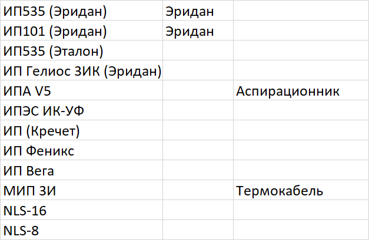

1. Исправить главное окно.
   - Добавить остальные типы датчиков.
2. Добавить информацию в библиотеку остальные датчики , возможно вынести матрицу с адресами в отдельный файл

### Внимание!

1. Могут быть пустые сетевые устройства, резервные (без шлейфов -> без датчиков) как то нужно решить это при выборе!

    1: "ИП-535 (Эридан)"         # SKAU03ADDRESSTYPE_MD_EIPR
    2: "ИП-101 (Эридан)"         # SKAU03ADDRESSTYPE_MD_EIPT     
     3: "ИП-535 (Эталон)"         # SKAU03ADDRESSTYPE_MD_EXIP535
    4: "ИП Гелиос 3ИК (Эридан)"  # SKAU03ADDRESSTYPE_MD_GELIOS3IK
    5: "ИПА V5"                  # SKAU03ADDRESSTYPE_MD_IPA
    6: "ИПЭС ИК-УФ"              # SKAU03ADDRESSTYPE_MD_IPESIKUF
    7: "ИП Кречет"               # SKAU03ADDRESSTYPE_MD_KRECHET
    8: "ИП Феникс"               # SKAU03ADDRESSTYPE_MD_PHOENIX  
     9: "ИП Вега"                 # SKAU03ADDRESSTYPE_MD_VEGA
    10: "МИП 3И"                 # SKAU03ADDRESSTYPE_MD_MIP
     11: "NLS-16"                 # SKAU03ADDRESSTYPE_MD_AI
     12: "NLS-8"                  

    51: "А2ДПИ",        # ATTYPE_A2DPI
    52: "АВИ",          # ATTYPE_AVI
    53: "АМК",          # ATTYPE_AMK
    54: "АР-1",         # ATTYPE_AR1
    55: "АР-5",         # ATTYPE_AR5
    56: "АРМини",       # ATTYPE_ARMINI
    57: "АТИ",          # ATTYPE_ATI
    58: "АОПИ",         # ATTYPE_AOPI
    59: "ИРС",          # ATTYPE_IRS
    60: "ИР-П",         # ATTYPE_A2RPI
    61: "ИСМ-5",        # ATTYPE_ISM5
    62: "ИСМ-22",       # ATTYPE_ISM22_1
    63: "ИСМ-22",       # ATTYPE_ISM22_2
    64: "ИСМ-220-4",    # ATTYPE_ISM4
    65: "МКЗ",          # ATTYPE_MKZ
    66: "ОСЗ",          # ATTYPE_OSZ
    67: "ОСЗ9",         # ATTYPE_OSZ9

## ModBus устройства

